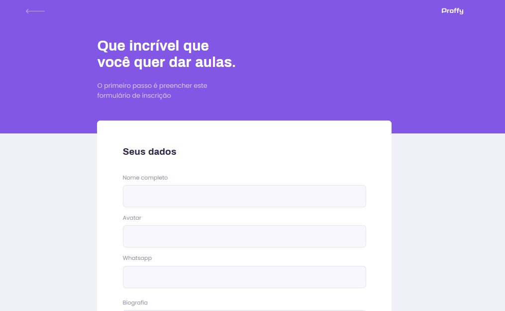
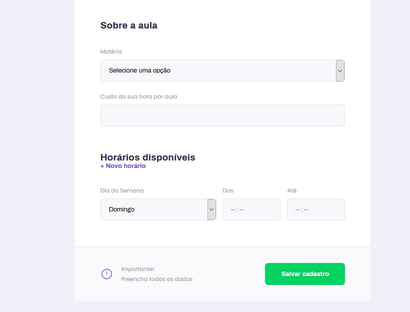
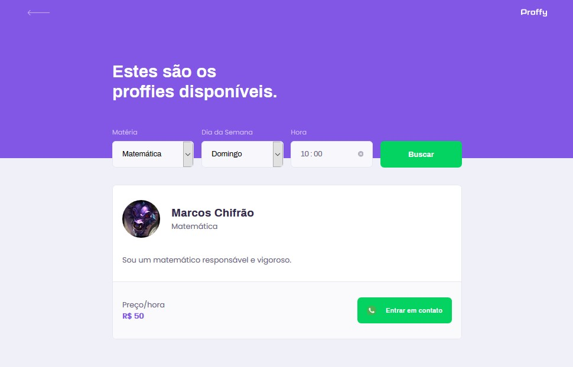

# Proffy Web

Este sistema desenvolvido em ReactJS é o ponto principal de conexão entre professores e alunos da plataforma Proffy.

Acessando o sistema, o usuário pode de cadastrar como professor de algumas matérias, e também listar e entrar em contato com professores já cadastrados.

## 1. Telas

O layouy da aplicação foi desenvolvido utilizando conceitos de _mobile-first_, dando preferência ao design de dispositivos móveis. Ele também funciona como PWA.

### 1.1 Landing Page

Na página inicial, o usuário pode escolher entre cadastrar-se como professor ou listar os professores cadastrados. Também é possível visualizar a quantidade de conexões criadas entre professores e potenciais estudantes.

### 1.2 Cadastro de Proffy

Na tela de cadastro, o professor informa seus dados, como nome, um link para uma imagem de avatar, número de whatsapp e biografia, informa a matéria e o custo da hora/aula que deseja lecionar, e então preenche os horários disponíveis para dar suas aulas.

 

### 1.3 Listagem de Proffies

Na tela de listagem, o usuário informa a matéria que deseja aprender, o dia da semana e o horário que deseja ter aula, e o sistema busca os professores disponíveis.

## 2. Sobre a Aplicação

A aplicação foi desenvolvida em ReactJS utilizando o [Create React App](https://create-react-app.dev/) para preparar o ambiente de desenvolvimento e cuidar do ambiente de produção.

Além disso, incluímos também o **[Axios](https://www.npmjs.com/package/axios)**, um cliente HTTP baseado em Promises, que foi utilizado para realizar as diversas chamadas a API.
